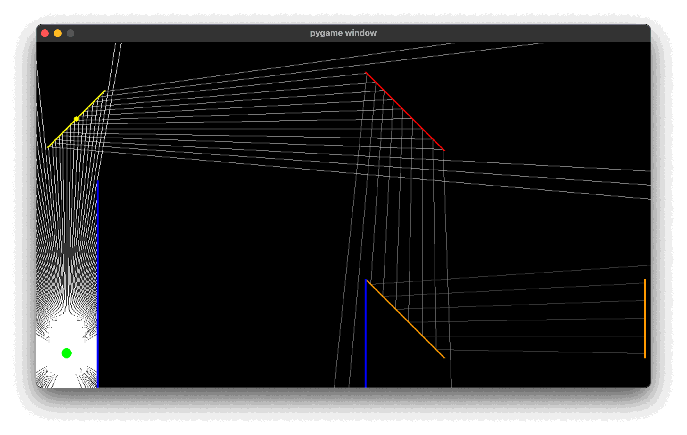
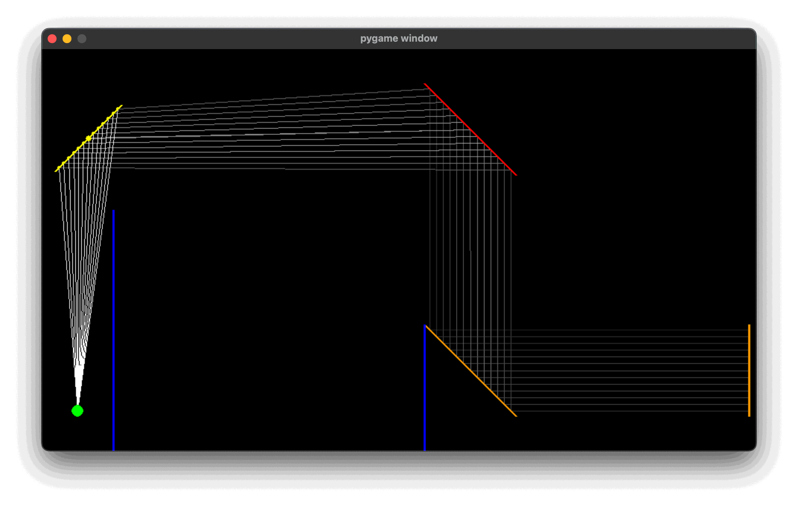
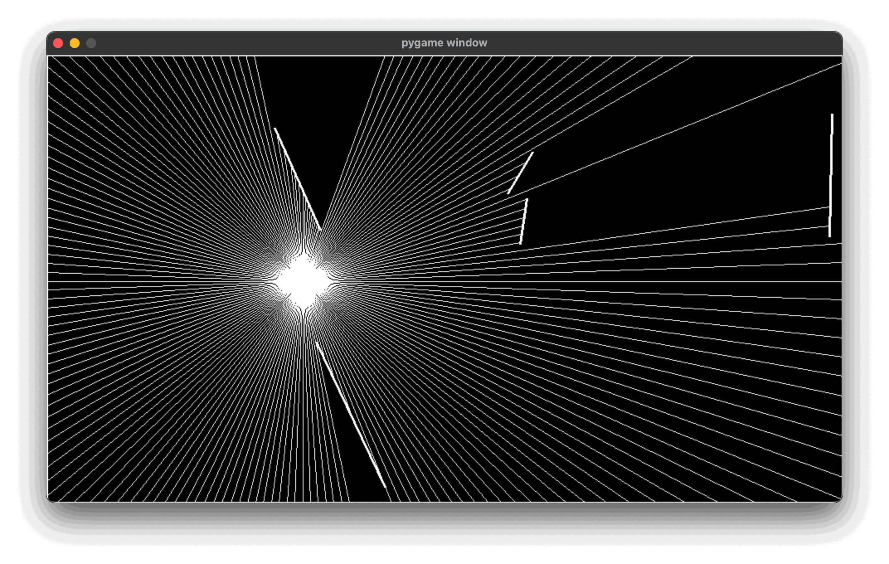

# 2D Ray Tracing

2D ray tracing made with python and pygame.

This project was forked from [000Nobody/2D-Ray-Tracing](https://github.com/000Nobody/2D-Ray-Tracing) and adds a file with specular reflections, as well as a comparison between direction sampling and surface sampling.

## Installation

* Clone GitHub repository
* Download required dependencies: `$ pip install -r requirements.txt`

## Moving reflector

    

        
        
<em>Direction Sampling</em>

    

    

        
        
<em>Surface Sampling</em>

    

Ray Tracing with specular reflections. Static emitter, moving reflector. Additional toggling between direction sampling and surface sampling.

* `$ python moving-reflector.py`
- **Mouse Move**: Move controllable wall position
- **Mouse Wheel**: Fine-rotate controllable wall
- **A**: Rotate controllable wall counter-clockwise
- **D**: Rotate controllable wall clockwise
- **R**: Reset controllable wall angle to default
- **Up Arrow**: Increase number of rays (direction-sampling) or samples (surface-sampling)
- **Down Arrow**: Decrease number of rays (direction-sampling) or samples (surface-sampling)
- **Left Arrow**: Decrease max reflection order
- **Right Arrow**: Increase max reflection order
- **D**: Toggle between direction-sampling and surface-sampling
- **T**: Toggle between 250 and 20 rays (direction-sampling mode only)
- **Q**: Decrease Phong exponent (less specular, surface-sampling mode only)
- **E**: Increase Phong exponent (more specular, surface-sampling mode only)

## Moving emitter

    

Ray Tracing without reflections. Static random surfaces, moving emitter.

* `$ python moving-emitter.py`
* Feel free to edit the options at the top of the script
* Move the ray source with the mouse, randomize the walls with the space key